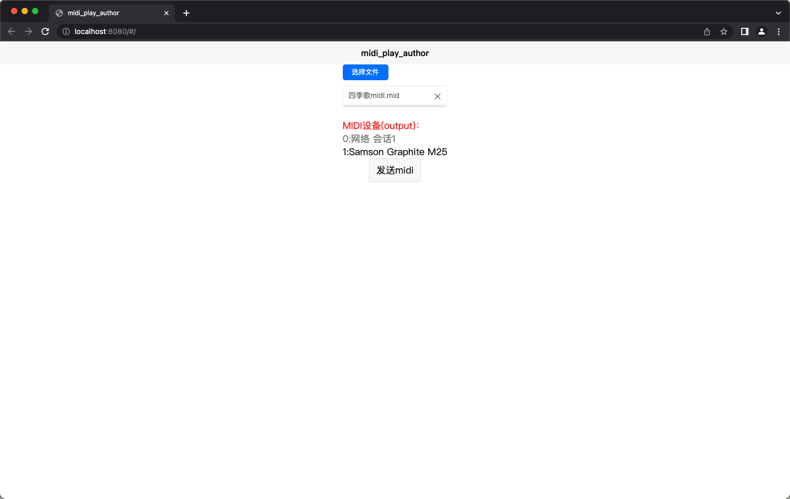

## midi演奏家

这是一个辅助工具库，可以在本地选择midi文件，可以选择与电脑连接的USB midi设备，将解析的midi文件以正常演奏的时间节点转发到midi设备

## 支持平台  

|平台|是否支持|
|-|-|
|Chrome|支持|

## 部分截图

## 运行平台

1.该项目是通过HBuilder创建的uniapp，通过工具导入后运行
2.或者自行创建vue项目，将关键代码和依赖复制出去运行